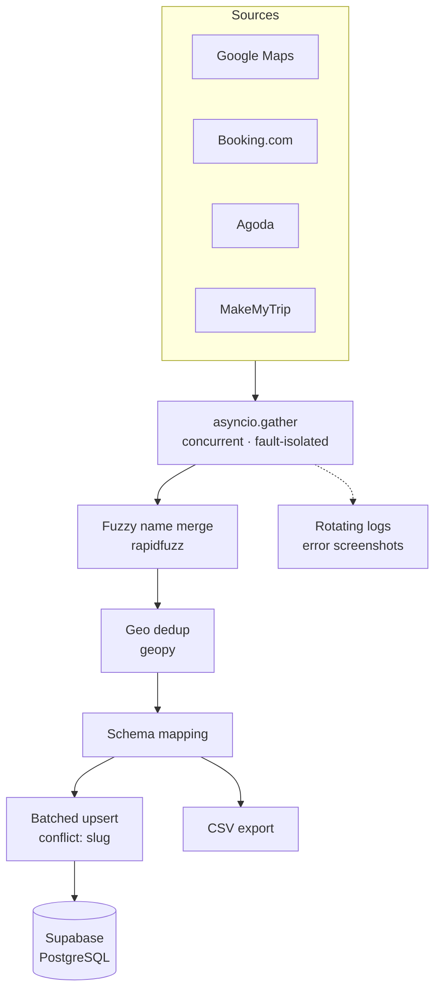

<!--
  README.md — github.com/NihasCM/NihasCM
  ─────────────────────────────────────────────────────────────────────────
  MERGE NOTES — visual design from v1, technical content from v2.

  KEPT from your original: centered header with color, section rhythm,
  whoami YAML, stats card, contribution snake, clean contact row.

  DROPPED: capsule-render banner + readme-typing-svg. Both are the same
  class of community-hosted service as streak-stats — same rate limits,
  same 502s. A broken image in the FIRST 100px is the worst possible
  failure. The header below uses GitHub-native HTML and cannot break.

  DROPPED: badge wall (21 requests), 5-widget analytics block, streak,
  language donut, profile-view counter, ASCII diagram.

  ADDED: differentiator line, scannable 5-line project cards, Mermaid.

  EXTERNAL REQUESTS: 2 — github-readme-stats (official) and the snake SVG
  from your own output branch. Mermaid renders natively, costs nothing.

  ⚠ BLOCKING: scrapping · hotel-harmony · tirulocal-hub are PRIVATE.
  Those three links 404 for everyone but you. Make them public before
  publishing, or delete the entries. Everything else is ready to ship.

  Verified against the repos via GitHub API on 2026-07-29. Every claim
  traces to a file. No metrics appear because none are measured anywhere
  in the code — do not add any you cannot demonstrate.
  ─────────────────────────────────────────────────────────────────────────
-->

<div align="center">

# Nihas

### Backend Engineer — Data Pipelines & Operational Platforms

**I build operational software for logistics, hospitality, and business
workflows** — data pipelines, automation, and the backends behind them.

`Python` · `TypeScript` · `PostgreSQL` · `asyncio` · `Supabase`

Dubai, UAE · GMT+4 · Open to backend, platform, and data engineering roles

</div>

---

<table>
<tr>
<td width="55%" valign="top">

### `> whoami`

```yaml
focus:        Data pipelines · operational platforms
languages:    Python · TypeScript
backend:      asyncio · Playwright · Supabase/Postgres
frontend:     React · TanStack Router · Tailwind
systems:      Concurrent I/O · record dedup
              idempotent upserts
building:     Multi-source listing aggregation
              hospitality & local-commerce ops tooling
open_to:      Backend · platform · data
timezone:     GMT+4 (Dubai)
```

</td>
<td width="45%" valign="top" align="center">

<!-- Official github-readme-stats. Most repos are private, so include_all_commits
     keeps this from understating the work. 24h cache. -->


</td>
</tr>
</table>

---

## Selected Work

<!--
  Five lines each: what it is → problem → stack → the one technical detail
  worth clicking for → link. Depth lives in each repo's own README.
  Where a project is mock-backed, it says so.
-->

### Multi-Source Listing Aggregation Pipeline

Merges hotel and service-provider listings from four sources into one
deduplicated Postgres table.

- **Problem** — the same property appears on four sites with different names,
  partial contact data, and inconsistent coordinates
- **Approach** — scrapers run concurrently under `asyncio.gather`; two-stage
  dedup (fuzzy name match, then geodesic distance) collapses duplicates;
  idempotent upsert so re-runs enrich rows instead of resetting them
- **Stack** — `asyncio` · `Playwright` · `rapidfuzz` · `geopy` · `Supabase`
- **Repo** — [scrapping](https://github.com/NihasCM/scrapping) *(architecture in `CLAUDE.md`)*

### Hotel Operations Platform

Property management across rooms, guests, payments, reporting, and payment
reconciliation.

- **Problem** — hotel payments arrive over UPI, GPay, PhonePe, and card, and
  have to be matched against booking records before revenue can be trusted
- **Approach** — one generic typed `request<T>` wrapper under six domain
  modules, so HTTP errors normalize at a single boundary; CSV reconciliation
  resolves system references against bank references
- **Stack** — `React` · `TypeScript` · `Tailwind` · `Vitest` · `Docker`
- **Repo** — [hotel-harmony](https://github.com/NihasCM/hotel-harmony) *(API layer runs on mock data; backend is separate)*

### Local Commerce Platform

Two-sided platform: public directory across six categories, plus an admin
console for the operators running it.

- **Problem** — a directory is only as good as the tooling behind it; listings,
  reviews, and content need moderation, not just display
- **Approach** — parameterized routes per category with six detail components
  on a shared layout contract; admin side covers listings, reviews, users,
  categories, CMS, analytics, and an activity log
- **Stack** — `React` · `TypeScript` · `TanStack Router` · `Tailwind` · `Vitest`
- **Repo** — [tirulocal-hub](https://github.com/NihasCM/tirulocal-hub) *(43 commits, most-iterated project here)*

---

## Pipeline Architecture

<!-- The aggregation pipeline as actually implemented in main.py:run_pipeline.
     Mermaid renders natively on github.com — no external service, no broken
     image risk, theme-aware, scrolls cleanly on mobile. -->



**Three decisions worth asking me about**

- Dedup needs both signals: names differ across sources, coordinates go
  missing — either one alone produces false merges
- Upsert keys on a generated slug, because no source ID is shared by all four
  providers
- Each source is trusted only for fields it owns — Maps for coordinates and
  contact, OTAs for price

---

## Stack

<!-- Only technologies present in repository code. HTML/CSS/Git omitted as
     baseline. Flutter, Firebase, MySQL, Streamlit, UiPath omitted — no repo
     uses them. Add a row back the day a repo justifies it. -->

| | |
|---|---|
| **Languages** | Python · TypeScript · JavaScript · SQL |
| **Backend** | asyncio · Playwright · Flask · REST clients |
| **Data** | rapidfuzz · geopy · pandas · openpyxl |
| **Frontend** | React · TanStack Router · Tailwind CSS · Vite |
| **Databases** | PostgreSQL · Supabase (PL/pgSQL, RLS) |
| **Testing** | Vitest |
| **DevOps** | Docker · GitHub Actions · Netlify · GitHub Pages |
| **Tools** | Git · ESLint · Prettier · Bun |

---

## Also Public

**KZ IOR/EOR Information System** — Flask app for searching Kazakhstan
import/export compliance data across four manufacturer datasets. Part-number
search resolving HS codes, ECCN, and license requirements out of Excel via
pandas. · [Aamro-Project](https://github.com/NihasCM/Aamro-Project)

---

<div align="center">

<picture>
  <source media="(prefers-color-scheme: dark)" srcset="https://raw.githubusercontent.com/NihasCM/NihasCM/output/github-contribution-grid-snake-dark.svg">
  
</picture>

<br><br>

**[LinkedIn](https://www.linkedin.com/in/nihas23/)** ·
**[Portfolio](https://nihascm.github.io/nihascm.dev/)** ·
**nihas.n@gogox.com**

</div>
