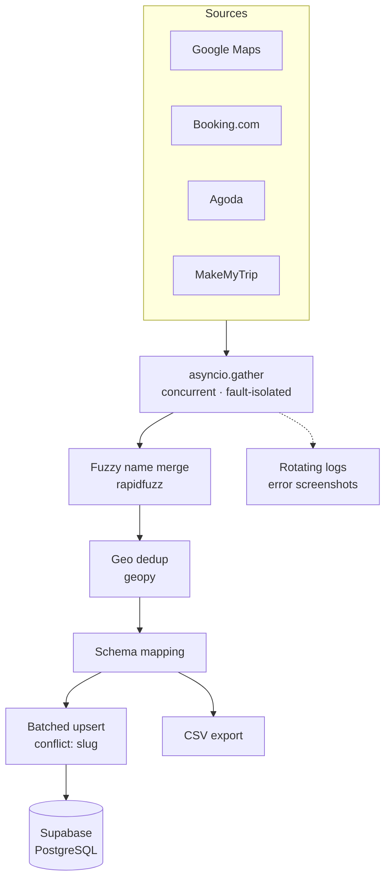

<!--
  README.md — github.com/NihasCM/NihasCM
  ─────────────────────────────────────────────────────────────────────────
  ORDER: proof before biography. Header → Projects → Architecture →
  Current Focus → whoami → Stack → Activity → Contact.

  EXTERNAL REQUESTS: 3 — capsule-render (header), github-readme-stats
  (official), snake SVG (self-hosted on your own output branch).
  Mermaid renders natively and costs nothing.

  Note on the banner: capsule-render is community-hosted, so it can 502.
  Every image here has real alt text, so a failed load degrades to a
  readable text line rather than a broken-image icon. That's the mitigation.

  ⚠ BLOCKING: scrapping · hotel-harmony · tirulocal-hub are PRIVATE.
  Those three links 404 for everyone but you. Make them public before
  publishing, or delete the entries.

  Verified against the repos via GitHub API on 2026-07-29. Every claim
  traces to a file. No metrics appear because none are measured anywhere
  in the code — do not add any you cannot demonstrate.
  ─────────────────────────────────────────────────────────────────────────
-->

<div align="center">


**Building systems that automate operations, aggregate data, and power
business workflows.**

`Python` · `TypeScript` · `PostgreSQL` · `asyncio` · `Supabase`

Dubai, UAE · GMT+4 · Open to Backend & Platform Engineering

</div>

---

## Featured Projects

<!--
  Uniform shape per project: one-line summary → stack → highlights → repo.
  Same structure every time so the eye lands in the same place. Depth lives
  in each repo's own README.
-->

### Multi-Source Listing Aggregation Pipeline

> Concurrent pipeline that aggregates and deduplicates listings from four
> travel and mapping providers into a single Postgres table.

**Stack**
Python · asyncio · Playwright · rapidfuzz · geopy · Supabase

**Highlights**

- Concurrent scraping via `asyncio.gather`, fault-isolated per source
- Two-stage deduplication: fuzzy name matching, then geospatial distance
- Idempotent upserts — re-runs enrich rows instead of resetting them
- Per-source field trust: maps for coordinates, OTAs for price
- Rotating logs with error screenshots on scraper failure

**Repository**
[NihasCM/scrapping](https://github.com/NihasCM/scrapping) — architecture documented in `CLAUDE.md`

### Hotel Operations Platform

> Property management across rooms, guests, payments, reporting, and
> multi-method payment reconciliation.

**Stack**
React · TypeScript · Tailwind CSS · Vitest · Docker

**Highlights**

- Generic typed `request<T>` wrapper over six domain modules
- HTTP errors normalized at a single boundary
- CSV reconciliation matching system refs against bank refs
- Covers UPI, GPay, PhonePe, and card with matched/unmatched/pending states

**Repository**
[NihasCM/hotel-harmony](https://github.com/NihasCM/hotel-harmony) — API layer runs on mock data; backend is separate

### Local Commerce Platform

> Two-sided platform: public directory across six categories, plus an admin
> console for the operators running it.

**Stack**
React · TypeScript · TanStack Router · Tailwind CSS · Vitest

**Highlights**

- Parameterized routes per category, six detail components on one layout contract
- Admin side: listings, reviews, users, categories, CMS, analytics, activity log
- Largest codebase here (~509 KB TypeScript), 43 commits

**Repository**
[NihasCM/tirulocal-hub](https://github.com/NihasCM/tirulocal-hub)

### KZ IOR/EOR Information System

> Flask app for searching Kazakhstan import/export compliance data across
> four manufacturer datasets.

**Stack**
Python · Flask · pandas · openpyxl

**Highlights**

- Part-number search resolving HS codes, ECCN, and license requirements
- Normalizes inconsistent Excel headers across four vendor sources

**Repository**
[NihasCM/Aamro-Project](https://github.com/NihasCM/Aamro-Project)

---

## Pipeline Architecture

<!-- The aggregation pipeline as implemented in main.py:run_pipeline.
     Mermaid renders natively on github.com — theme-aware, no external
     request, scrolls cleanly on mobile. -->



**Three decisions worth asking me about**

- Dedup needs both signals: names differ across sources, coordinates go
  missing — either alone produces false merges
- Upsert keys on a generated slug, because no source ID is shared by all
  four providers
- Each source is trusted only for the fields it owns

---

## Current Focus

- Backend engineering — concurrent I/O, data pipelines
- PostgreSQL & Supabase — schema design, idempotent writes, RLS
- Operational platforms — admin tooling, reconciliation, workflow state
- Automation — multi-source data collection and normalization

---

<table>
<tr>
<td width="55%" valign="top">

### `> whoami`

```yaml
focus:        Data pipelines · operational platforms
languages:    Python · TypeScript
backend:      asyncio · Playwright · Supabase/Postgres
frontend:     React · TanStack Router · Tailwind
systems:      Concurrent I/O · record dedup
              idempotent upserts
building:     Multi-source listing aggregation
              hospitality & local-commerce ops tooling
open_to:      Backend · platform · data
timezone:     GMT+4 (Dubai)
```

</td>
<td width="45%" valign="top" align="center">

<!-- Official github-readme-stats. Most repos are private, so
     include_all_commits keeps this from understating the work. -->


</td>
</tr>
</table>

---

## Stack

<!-- Only technologies present in repository code. HTML/CSS/Git omitted as
     baseline. Flutter, Firebase, MySQL, Streamlit, UiPath omitted — no repo
     uses them. Add a row back the day a repo justifies it. -->

| | |
|---|---|
| **Languages** | Python · TypeScript · JavaScript · SQL |
| **Backend** | asyncio · Playwright · Flask · REST clients |
| **Data** | rapidfuzz · geopy · pandas · openpyxl |
| **Frontend** | React · TanStack Router · Tailwind CSS · Vite |
| **Databases** | PostgreSQL · Supabase (PL/pgSQL, RLS) |
| **Testing** | Vitest |
| **DevOps** | Docker · GitHub Actions · Netlify · GitHub Pages |
| **Tools** | Git · ESLint · Prettier · Bun |

---

<div align="center">

<picture>
  <source media="(prefers-color-scheme: dark)" srcset="https://raw.githubusercontent.com/NihasCM/NihasCM/output/github-contribution-grid-snake-dark.svg">
  
</picture>

<br><br>

**[LinkedIn](https://www.linkedin.com/in/nihas23/)** ·
**[Portfolio](https://nihascm.github.io/nihascm.dev/)** ·
**nihas.n@gogox.com**

</div>
